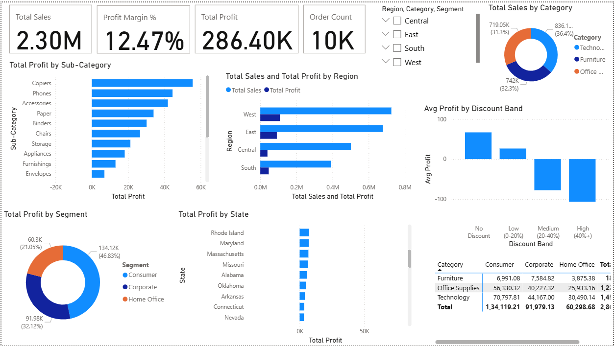
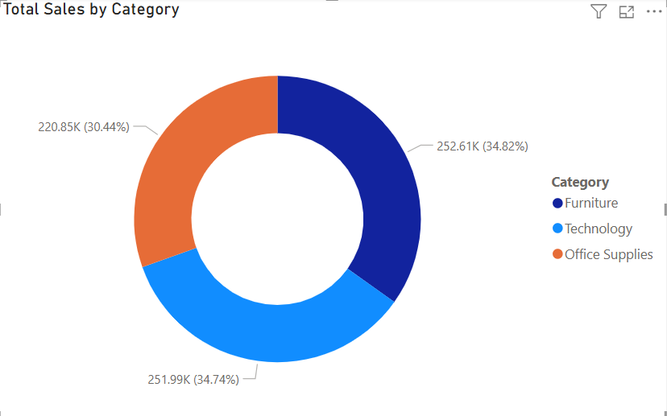
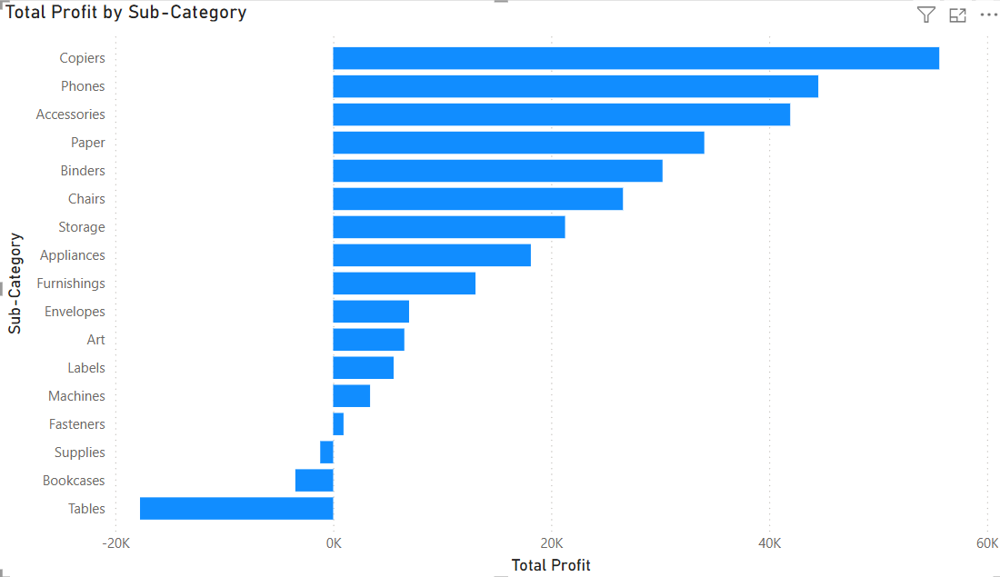
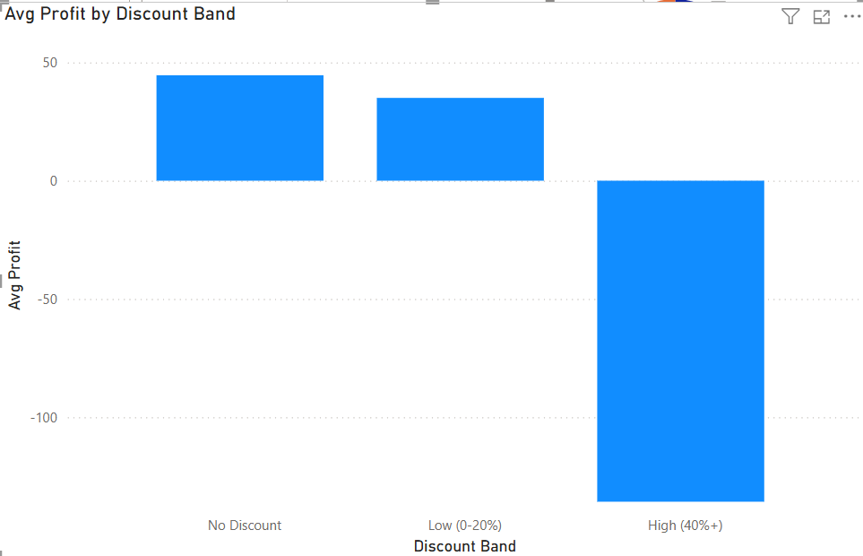
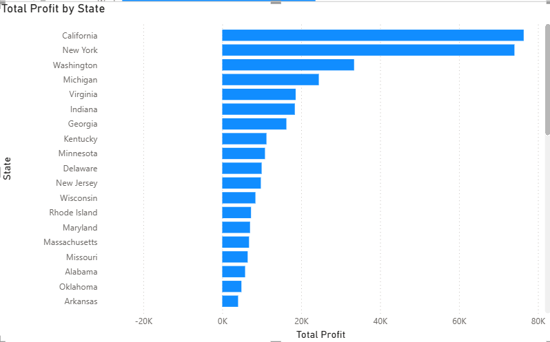
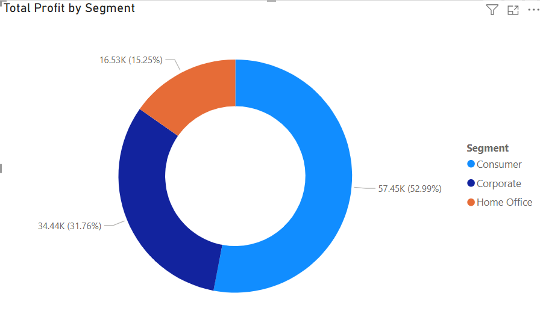
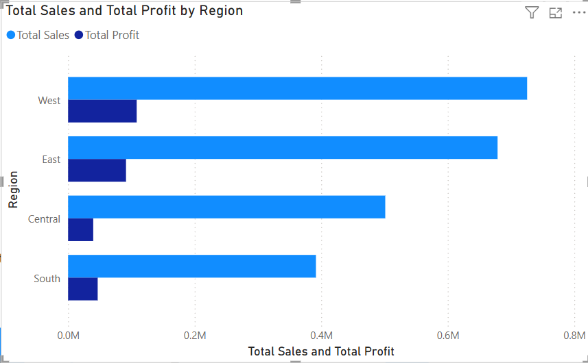

# Retail Sales Analytics

An end-to-end Data Analytics project focused on identifying the factors affecting business profitability using **Python, SQL, and Power BI**. The project demonstrates the complete analytics workflow—from data cleaning and exploratory analysis to SQL-based business insights and interactive dashboard development.

---

# Project Overview

Although the company generated strong sales, profitability was inconsistent across different product categories, customer segments, and regions.

The objective of this project was to analyze retail transaction data to identify the root causes behind low profitability and provide actionable business recommendations using data-driven insights.

The project follows a complete analytics pipeline:

```
Raw Dataset
      │
      ▼
Data Cleaning & Preprocessing (Python)
      │
      ▼
Exploratory Data Analysis (EDA)
      │
      ▼
Feature Engineering
      │
      ▼
SQL Business Analysis
      │
      ▼
Power BI Dashboard
      │
      ▼
Business Insights & Recommendations
```

---

# Dataset

* **Dataset:** Sample Superstore Dataset
* **Source:** Kaggle
* **Total Records:** 9,994
* **Columns:** 13

The dataset contains Ship Mode, Segment, Country, City, State, Postal Code, Region,
Category, Sub-Category, Sales, Quantity, Discount, and Profit — covering product,
geographic, and customer-segment dimensions, along with the core sales and profitability
metrics.

---

# Business Problem

Despite generating more than **$2.3 Million in sales**, the business experienced inconsistent profitability.

The primary objective was to answer questions such as:

* Which product categories generate the highest profit?
* Which products are causing losses?
* Does discounting impact profitability?
* Which states and regions contribute the most profit?
* Which customer segments are most valuable?
* What business actions could improve profitability?

---

# Project Workflow

## 1. Data Cleaning (Python)

Performed data preprocessing using **Pandas** and **NumPy**.

Cleaning tasks included:

* Checked for missing values
* Removed duplicate records
* Converted Postal Code into a categorical/text field
* Verified data types
* Standardized column formatting
* Prepared clean data for analysis

---

## 2. Feature Engineering

Created additional business metrics including:

* Profit Margin (%)
* Discount Bands

  * No Discount
  * Low Discount (0–20%)
  * Medium Discount (20–40%)
  * High Discount (40%+)

These engineered features helped identify profitability trends across different discount levels.

---

## 3. Exploratory Data Analysis (EDA)

Performed exploratory analysis to understand:

* Sales distribution
* Profit distribution
* Category performance
* Regional performance
* Customer segment contribution
* Discount impact
* State-wise profitability
* Sub-category performance

Visualizations were created using **Matplotlib** and **Seaborn**.

---

## 4. SQL Business Analysis

Used SQLite to answer more than **15 business questions** involving:

* Total Sales
* Total Profit
* Profit Margin
* Category Analysis
* Sub-Category Analysis
* Regional Analysis
* State Analysis
* Customer Segment Analysis
* Discount Analysis

SQL concepts used:

* SELECT
* WHERE
* GROUP BY
* ORDER BY
* Aggregate Functions
* CASE WHEN
* HAVING
* Common Table Expressions (CTEs)
* Window Functions
* Ranking Functions

---

## 5. Dashboard Development

Developed an interactive Power BI dashboard containing:

* KPI Cards
* Sales by Category
* Profit by Category
* Profit by State
* Sales by Region
* Profit by Region
* Customer Segment Analysis
* Discount Band Analysis
* Category × Segment Matrix
* Interactive Slicers

Created DAX measures for:

* Total Sales
* Total Profit
* Total Orders
* Profit Margin %
* Average Profit

---

# Business Dashboard



---

# Key Business Metrics

| KPI           | Value             |
| ------------- | ----------------- |
| Total Sales   | **$2.30 Million** |
| Total Profit  | **$286,397**      |
| Profit Margin | **12.47%**        |
| Total Orders  | **9,994**         |

---

# Key Business Insights

## 1. Sales are evenly distributed, but profit is not

Although sales are fairly balanced across the three product categories:

| Category        | Sales Contribution |
| --------------- | ------------------ |
| Furniture       | 34.82%             |
| Technology      | 34.74%             |
| Office Supplies | 30.44%             |

Profit contribution tells a completely different story.

| Category        | Profit Contribution |
| --------------- | ------------------- |
| Technology      | **50.8%**           |
| Office Supplies | **42.8%**           |
| Furniture       | **6.4%**            |

### Insight

Furniture generates nearly one-third of total sales but contributes only a small portion of overall profit, indicating poor profitability despite healthy revenue.



---

## 2. Tables and Bookcases are the only loss-making Sub-Categories

Among all 17 product sub-categories, only:

* Tables
* Bookcases

operate at a net loss.

Every other sub-category remains profitable.

### Insight

Furniture's weak profitability is not a category-wide issue. The losses are concentrated in only two specific product groups.



---

## 3. Higher discounts significantly reduce profitability

Average profit decreases steadily as discount levels increase.

Observations:

* No Discount → Highest Profit
* Low Discount → Positive Profit
* Medium Discount → Lower Profit
* High Discount (40%+) → Negative Profit

### Insight

Aggressive discounting is likely reducing margins, particularly for Tables and Bookcases.



---

## 4. Profit is concentrated in a few states

California and New York generate significantly higher profits than every other state.

These two states contribute approximately twice the profit of the third-ranked state.

### Insight

Business profitability is geographically concentrated, suggesting these markets deserve greater strategic focus.



---

## 5. Consumer segment generates the highest profit

Profit contribution by customer segment:

| Segment     | Profit       |
| ----------- | ------------ |
| Consumer    | **$134,119** |
| Corporate   | **$91,979**  |
| Home Office | **$60,299**  |

### Insight

Consumer customers contribute nearly half of the company's total profit, making them the most valuable customer segment.



---

## 6. West region is the strongest performer

Among all four regions:

* West leads in both Sales and Profit.
* East ranks second.
* Central and South contribute comparatively less.

### Insight

Regional sales and profitability are closely aligned, unlike the imbalance observed across product categories.



---

# Business Recommendations

Based on the analysis, the following recommendations are proposed:

### Review discount strategy

Investigate the discount policies for **Tables** and **Bookcases**, as excessive discounting appears to eliminate profit margins.

---

### Improve Furniture profitability

Rather than changing the entire Furniture category, focus specifically on the two loss-making sub-categories.

---

### Prioritize high-performing markets

Increase marketing efforts and inventory planning in **California** and **New York**, which contribute a disproportionately large share of total profit.

---

### Strengthen Consumer segment

Continue investing in the Consumer segment through customer retention, targeted promotions, and personalized campaigns.

---

### Investigate Home Office performance

Analyze pricing, product mix, and purchasing behavior to understand why the Home Office segment contributes significantly less profit.

---

# Technologies Used

| Tool         | Purpose                   |
| ------------ | -------------------------- |
| Python       | Data Cleaning & EDA        |
| Pandas       | Data Manipulation          |
| NumPy        | Numerical Analysis         |
| Matplotlib   | Data Visualization         |
| Seaborn      | Statistical Visualization  |
| SQL (SQLite) | Business Query Analysis    |
| Power BI     | Interactive Dashboard      |
| DAX          | KPI Calculations           |

---

# Repository Structure

```
Retail_Sales_Analytics/
│
├── data/
│   ├── SampleSuperstore.csv
│   └── Superstore_Cleaned.csv
│
├── notebooks/
│   └── Retail_Sales_Analysis_Complete.ipynb
│
├── powerbi/
│   └── Retail_Sales_Dashboard.pbix
│
├── reports/
│   ├── Business_Insights.md
│   └── Retail_Sales_Dashboard.pdf
│
├── images/
│   ├── dashboard_full_view.png
│   ├── profit_by_subcategory.png
│   ├── avg_profit_by_discount_band.png
│   ├── total_profit_by_state.png
│   ├── total_profit_by_segment.png
│   ├── total_sales_by_category.png
│   ├── total_sales_profit_by_region.png
│   └── category_segment_matrix.png
│
└── README.md
```

---

# Skills Demonstrated

* Data Cleaning
* Exploratory Data Analysis (EDA)
* Feature Engineering
* Business Analytics
* SQL Query Writing
* Window Functions
* Common Table Expressions (CTEs)
* Data Visualization
* Dashboard Development
* DAX
* KPI Reporting
* Business Storytelling
* Data-Driven Decision Making

---

# Future Improvements

* Perform customer segmentation using RFM analysis.
* Build sales forecasting models using machine learning.
* Develop product recommendation models.
* Deploy the dashboard using Power BI Service.
* Automate data refresh with scheduled pipelines.

---

# Conclusion

This project demonstrates how an end-to-end analytics workflow can transform raw retail transaction data into meaningful business insights. By combining Python for data preparation and exploratory analysis, SQL for business-oriented querying, and Power BI for interactive visualization, the analysis uncovered profitability issues that were not apparent from sales data alone.

The findings highlight that strong revenue does not always translate into strong profit. Targeted actions—such as optimizing discount strategies, focusing on high-performing regions, and improving low-performing product groups—can significantly improve overall business performance.

---

Full write-up with interview talking points: [Business Insights](reports/Business_Insights.md)
